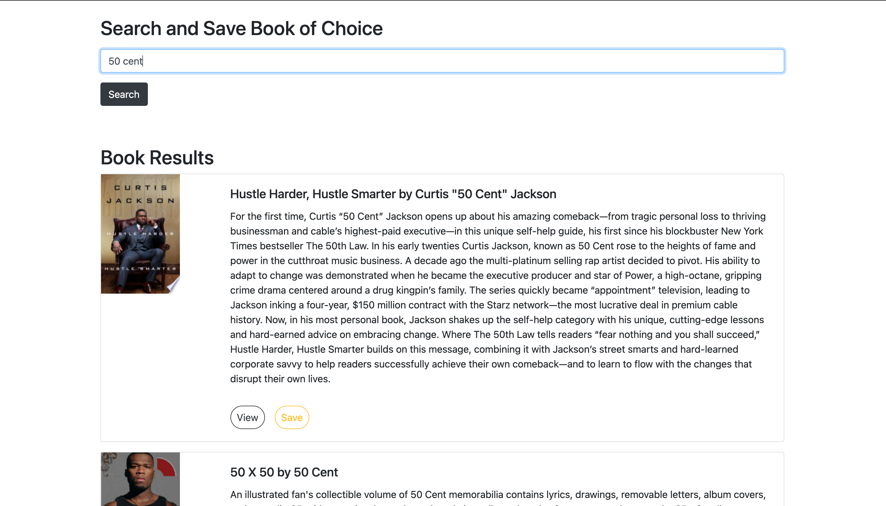

# Google Books Search

<h4 align="center">Full stack application<h4>

## Description

React-based Google Books Search app that displays books on user searches. Users can save them to review or purchase later. 

## Deployment 
This App is deployed on Heroku: [Google Books Search](https://fast-bastion-66631.herokuapp.com/)

<h2 align="center">

</h2>
## Dependencies
- [MongoDB](mongodb.com)
- [Express.js](https://expressjs.com)
- [React.js](https://reactjs.org/)
- [Node.js](https://nodejs.org/en/)

- Search for books using the [Google Books API](https://developers.google.com/books/)

## Author
Dominique Christopher | [ShowlandProductions](https://github.com/showlandproductions
